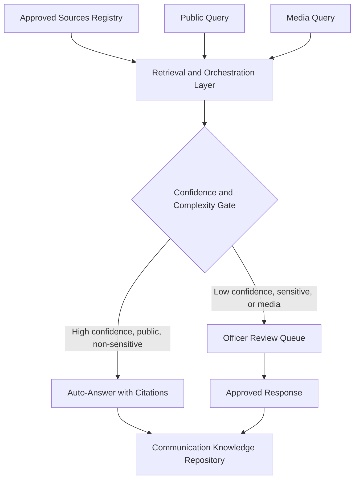

# AI-Enabled Assistant for Public and Media Information Queries

GovTech 2026 Hackathon submission for the Department of Statistics South Africa (Stats SA).

## Executive Summary

This solution is an AI-enabled assistant that answers public and media queries about Stats SA's official statistics, publications and organisational information, grounded entirely in an Approved Sources Registry (ASR) so that no response can cite or draft from material outside Stats SA's approved corpus. It splits queries onto two tracks: a public self-service path that auto-answers with citations when confidence is high and the query is factual and non-sensitive, and a media path that never auto-sends and instead always produces a structured, referenced draft for review by an authorised Communications Official. Human-in-the-loop review, role-based access control, POPIA-aligned data handling and a fully open-source technology stack run underneath both tracks, and a searchable communication knowledge repository lets officials reuse or adapt previously approved responses. The design maps every one of the challenge's 5 mandatory design requirements and 6 mandatory functional capabilities to a specific mechanism, documented in full in the linked sections below.

## Problem Statement

Stats SA receives a high volume of public and media queries, and preparing accurate, timely, clearly referenced responses requires reviewing large volumes of statistical data, publications and organisational information. Some queries recur, yet answering them can still require communication officials to search multiple publications and data sources to find authoritative information, which delays responses, increases administrative workload and raises the risk that a reply relies on information that is outdated, incomplete or not officially validated. This creates an opportunity for AI to assist with information retrieval and response drafting for sensitive, complex and media queries, while keeping human oversight, accuracy and governance central, and it points to the need for a central, trusted knowledge base where approved answers and reference material can be stored and reused.

## Solution Overview

Both the public and media paths retrieve exclusively from the Approved Sources Registry, so every answer or draft is traceable to an approved, versioned Stats SA source. A public query that clears a confidence-and-complexity gate is answered directly with citations; a public query that does not clear the gate, and every media query regardless of confidence, is routed to a Communications Official for review and approval before it reaches a requester.



## Judging Criteria Alignment

| Criterion | Weight | Score Rationale |
|---|---|---|
| Relevance to the Challenge Statement | 20% | Strongest category: the two-track routing flow maps directly onto both mandatory functional capabilities and all 5 mandatory design requirements. |
| Innovation and Use of Emerging Technologies | 15% | Moderate score: RAG over an approved corpus, confidence-based routing and reuse recommendation are established open-source patterns rather than novel research. |
| Technical Feasibility and Functionality | 20% | Hardest criterion given the build window: the MVP delivers a working retrieval pipeline and a minimal review interface, a narrower slice than the full design. |
| User Experience, Accessibility and Inclusivity | 10% | Honest gap: no dedicated design phase preceded the build, so the interface is a minimal chat widget and plain review dashboard with WCAG conformance unverified. |
| Data, Intelligence and Insight Generation | 10% | Every answer cites its source and title by default, and confidence scoring plus gap-flagging expose data limits to reviewers; trend analytics is deferred beyond MVP. |
| Security, Governance and Responsible Technology Use | 10% | Role-based access separates public, media and official users, human approval gates all media and low-confidence responses, and an audit log records the full query-to-approval trail live in the demo; a formal data-protection review is a roadmap item. |
| Scalability, Sustainability and Digital Sovereignty | 10% | Built on open-source components to avoid vendor lock-in, with an API-first design for later Stats SA website integration; long-term sustainability depends on Stats SA staff maintaining the source corpus. |
| Presentation, Demonstration and Communication | 5% | The demo script walks both routing paths, an instant cited public answer and a media draft awaiting approval, though time pressure risks compressing the human-in-the-loop moment. |

## Documentation

- [Requirements Traceability](docs/01-requirements-traceability.md) - Maps every mandatory design requirement and functional capability to the specific solution mechanism that satisfies it, plus the query routing flow between the public and media paths.
- [Architecture](docs/02-architecture.md) - Defines the end-to-end system architecture, component responsibilities, query life cycle, Approved Sources Registry schema and the open-source technology stack.
- [Security, Governance and Compliance](docs/03-security-governance-compliance.md) - Specifies the role-based access control model, data protection measures, POPIA and South African regulatory alignment, the human-in-the-loop review workflow and the audit-logging model.
- [Judging Criteria Alignment](docs/04-judging-criteria-alignment.md) - Scores the solution candidly against all 8 GovTech 2026 adjudication criteria, naming strengths and weak spots alongside mitigations.
- [MVP Scope and Roadmap](docs/05-mvp-scope-and-roadmap.md) - Fixes what is built for the hackathon demo versus deferred, sets out the demo script, risk register and post-hackathon roadmap phases.
- [Precedent Analysis](docs/06-precedent-analysis.md) - Compares the solution against ten confirmed public-sector AI query precedents (including SARS, DPSA, Statistics Canada, UK ONS, GOV.UK Chat, Eurostat and the US Census Bureau) and identifies the gaps it closes.

## Building the MVP

- [TASKS.md](TASKS.md) - the task board: what's built, what's claimed, what's next. Check here before starting anything.
- [CONTRIBUTING.md](CONTRIBUTING.md) - the Spec-Driven Development workflow: claim a task, branch, implement against its spec, PR into `master`, merge before starting the next one.
- [specs/](specs/) - one spec per feature (`000` is the MVP technical-decisions ADR simplifying the full architecture for a hackathon build; `001`-`011` are the buildable tasks).

### Run it locally

```bash
cp .env.example .env   # fill in LLM_API_KEY
cd infra
docker-compose up
```

Backend: http://localhost:8000/health · Frontend: http://localhost:5173
