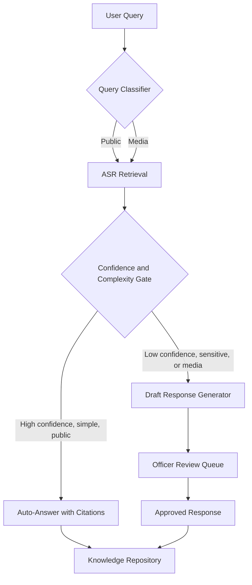

# Requirements Traceability

This solution enforces every mandatory requirement through one control point: the Approved Sources Registry (ASR), a closed, versioned index of Stats SA publications, releases and official statements. Retrieval, generation and review all operate inside that boundary, so no response can cite or draft from material outside it. The tables below map each mandatory requirement and each optional capability to the specific mechanism that satisfies it, not just a design intention.

## Table 1: Mandatory Design Requirements

| # | Requirement | Solution Mechanism | Evidence/Detail |
|---|---|---|---|
| 1 | Open Architecture and Sustainability | Open-source stack throughout: a self-hostable embedding model, an open-source vector store (e.g. Qdrant), and an open orchestration layer for retrieval. No proprietary lock-in on the knowledge or retrieval layer. | Component inventory and licence list in Section 02 (Architecture). |
| 2 | Web Integration and Deployment | A REST API and an embeddable JavaScript chat widget serve the public Stats SA website. A separate web console hosts the Communications Official review queue. | Described in prose in 02-architecture.md (Section 2, Component Responsibility) and 05-mvp-scope-and-roadmap.md (MVP Scope, Integration row). No literal API contract (endpoint list, methods, request/response schemas) or widget embed code snippet is published anywhere in this documentation set; producing both is an outstanding build-sprint deliverable, not yet documented. |
| 3 | Trusted Responses and Source Transparency | Every response carries a visible label, "Official Source" or "AI-Generated Draft." Inline citations show title, publication date and URL, pulled directly from the ASR record. | Citation enforcement and rendering approach in 02-architecture.md (Section 1.1, Retrieval Quality and Abstention Design); source metadata fields (title, url, published_date) in Section 4 (Approved Sources Registry). |
| 4 | Responsible AI and Governance | Human-in-the-loop escalation queue, logged model and prompt versions per response, and a standing AI-use disclosure banner on all public answers. | Escalation workflow in 03-security-governance-compliance.md (Section 4, Human-in-the-Loop Workflow); audit fields in Section 5 (Accountability and Audit Logging). |
| 5 | Data Security and Privacy | Role-based access control spans four roles: Public, Media/Journalist, Communications Official, Curator-Admin. TLS in transit, encryption at rest, and POPIA-aligned handling apply, with no persistent storage of personal data beyond session logs. | RBAC table in 03-security-governance-compliance.md (Section 1, Role-Based Access Control); encryption controls in Section 2 (Data Protection Measures); POPIA alignment in Section 3. |

## Table 2: Mandatory Functional Capabilities

The six capabilities split into two response paths: a public auto-answer path (capability 1) that can respond directly when confidence is high, and a media draft-and-review path (capability 2) that never auto-sends. Capabilities 3 to 6 support both paths.

| # | Requirement | Solution Mechanism | Evidence/Detail |
|---|---|---|---|
| 1 | Public Self-Service Search Assistant | Natural-language intake with retrieval scoped to the ASR only, gated by a confidence-and-complexity check. The system auto-answers with citations only when confidence clears a set threshold and the query is factual and non-sensitive. Everything below the threshold escalates. | Threshold logic and escalation triggers in Section 02 (Architecture); sample queries in Section 06. |
| 2 | Media Query Escalation and Draft Response Generation | A separate media intake channel never auto-issues a response. It always produces a structured draft (summary, key facts, sources, suggested tone) and routes it to the Officer Review Queue. Information gaps are flagged instead of filled. | Draft structure in 05-mvp-scope-and-roadmap.md (MVP Scope, Media query path row); gap-flagging step in 02-architecture.md (Section 3, Query Life Cycle sequence diagram: "Draft with citations and gap flags"). |
| 3 | Human-in-the-Loop Review and Approval | A Review Queue interface offers approve, edit and reject actions. Officer identity and decision timestamp are recorded before any media or low-confidence response is released. | Review workflow in 03-security-governance-compliance.md (Section 4, Human-in-the-Loop Workflow); audit log schema in Section 5 (Accountability and Audit Logging). |
| 4 | Accuracy and Source Grounding | Retrieval-augmented generation is constrained to ASR content only. An automated groundedness check compares generated text against retrieved passages before display. | Groundedness check method in Section 02 (Architecture). |
| 5 | Organisational Knowledge and Communication Guidelines | A curator-maintained list of approved terminology and style notes is edited through the same Curator-Admin UI used for source documents. This documentation set does not yet specify a defined schema for the list, a formal update-approval workflow, or how it is injected into generation prompts. | Terminology and style-notes editing in 05-mvp-scope-and-roadmap.md (MVP Scope, Curator-admin row) — the only reference to this feature in the doc set. Treat as a partially evidenced capability until a guide schema and prompt-injection mechanism are documented. |
| 6 | Communication Memory and Response Reuse | A Communication Knowledge Repository stores approved responses, press releases and FAQs, searchable by authorised users. Similarity search surfaces prior approved answers as supplementary context once an item reaches the Review Console, alongside confidence scores and sources, before the Communications Official approves, edits or rejects a draft. | Repository description in 05-mvp-scope-and-roadmap.md (MVP Scope, Communication memory row); reuse-match display in 03-security-governance-compliance.md (Section 4, Human-in-the-Loop Workflow, step D). |

## Process Flow: Query Routing Across Both Paths

## Table 3: Optional but Advantageous Capabilities

This table also serves as evidence for the Innovation and Use of Emerging Technologies judging criterion.

| # | Capability | Included in Hackathon Build? | Justification |
|---|---|---|---|
| 1 | Intelligent Document and Content Analysis | Partial | The ingestion pipeline extracts titles, dates and key statistics at index time. Full trend and insight analysis across releases is described only. |
| 2 | Communication Support Assistant | Yes | Built into the media draft path. It retrieves source material, summarises evidence and surfaces approved terminology on every draft. |
| 3 | AI-Assisted Press and Media Release Generation | Partial | Draft generation for media queries is implemented. User-selectable format, audience and detail-level controls are described only. |
| 4 | Audience and Channel Adaptation | Described only | The architecture reserves a channel-adaptation layer in the pipeline. It is not built for the hackathon prototype. |
| 5 | Multilingual and Inclusive Communication | Described only | No language-toggle or multilingual feature is listed in the hackathon MVP scope (05-mvp-scope-and-roadmap.md, MVP Scope table, Public query path row). Multilingual expansion, starting with isiZulu and Afrikaans, is placed in the post-hackathon Rollout phase (3-9 months) in the same document's Roadmap section. |
| 6 | Integration and Interoperability | Yes | API-first design demonstrated with a working REST endpoint and a website widget embed, both usable by external systems. |

Docs 02 through 06 in the docs folder — Architecture, Security/Governance/Compliance, Judging Criteria Alignment, MVP Scope and Roadmap, and Precedent Analysis — contain the underlying detail that each row above cites.
