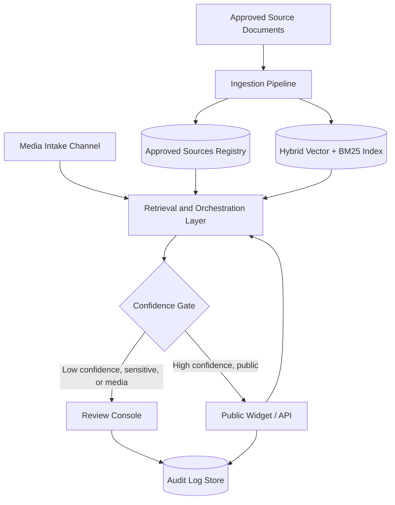
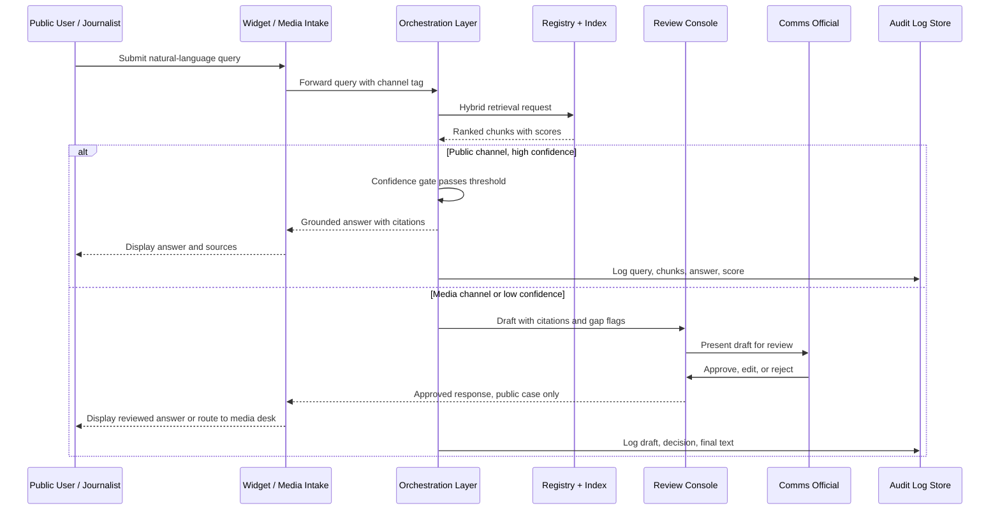

# System Architecture and Technology Stack

This section defines the technical architecture for the Stats SA AI-Enabled Assistant. It covers the end-to-end pipeline, component responsibilities, query life cycles, the Approved Sources Registry, and the technology stack. Every design choice traces back to a Mandatory Design Requirement, a Mandatory Functional Capability, or a named GovTech 2026 judging criterion.

## 1. End-to-End System Architecture

The architecture separates four concerns: source ingestion, trusted storage, retrieval and orchestration, and channel-specific delivery with human review. This separation lets curator-admins update the approved knowledge base without redeploying the public widget or media workflow.

Retrieval combines dense vector search and BM25 keyword search, fused by reciprocal rank, the documented 2026 production baseline for government document search ([government chatbot buyer's guide](https://www.chitika.com/best-ai-chatbot-for-government-agencies-in-2026-a-buyers-guide/)). Retrieval is restricted to the Approved Sources Registry corpus only, with a minimum relevance threshold below which the system returns no answer ([government chatbot document-search guide](https://pollthepeople.app/best-ai-chatbot-government-document-search-2026/)).

### 1.1 Retrieval Quality and Abstention Design

This design is phased: the MVP implements the subset below that needs no model training or labelled-data pipeline, and the remaining techniques are roadmap enhancements once real usage data exists to support them. The full target, informed by current retrieval-augmented generation research, layers five techniques before any answer reaches a user:

- **Hybrid dense-and-sparse retrieval** (MVP) to reduce wrong-chunk retrieval, the failure mode confidence gating alone cannot catch.
- **A CRAG-inspired relevance check** (MVP, prompt-based) that scores each chunk as Correct, Ambiguous, or Incorrect using the same inference call already made for generation, so it needs no separate model, service, or training run ([CRAG](https://arxiv.org/abs/2401.15884)).
- **Confidence-aware reranking** (roadmap) that would treat the generator's own confidence shift as posterior evidence of chunk usefulness ([CAR](https://arxiv.org/pdf/2605.04495)); deferred past the hackathon build to keep the MVP's retrieval path simple and auditable.
- **A graded evidence-sufficiency check** (roadmap), which would replace the MVP's binary threshold with an escalate-when-support-is-thin rule ([Evidence Sufficiency Benchmark](https://www.sciencedirect.com/org/science/article/pii/S1546221826007526)).
- **Structured citation objects, checked against retrieved chunk boundaries** (MVP), enforced deterministically at generation time: every citation must resolve to a real chunk_id and offset range, or the claim is dropped and marked unsourced. This is a structural, rule-based check, not a semantic one, so it also needs no separate model.

Abstention is treated as its own capability rather than a prompt instruction. Prompt-only refusal instructions fail to distinguish missing evidence from misleading evidence in small models ([GRAB-RAG](https://arxiv.org/html/2608.22228)). Logic-guided retrieval lifts refusal accuracy on unanswerable questions from 0.767 to 0.828 while cutting hallucination rate from 0.128 to 0.083 ([LogicalRAG](https://arxiv.org/pdf/2605.27123)); this logic-guided form is a roadmap item, not an MVP commitment.

For the MVP, abstention runs on the confidence score alone: the Confidence Gate withholds a direct public answer when the score falls below a fixed threshold (e.g. 0.75), matching the MVP Scope table in `05-mvp-scope-and-roadmap.md`. Verbalized confidence, calibrated by explicitly rewarding accurate self-reported confidence during model training ([I-CALM](https://arxiv.org/html/2604.03904)), is a longer-term roadmap target rather than an MVP commitment: it needs labelled interaction data and a fine-tuning or reward-model pipeline that a hackathon build has no time to produce. Until that data and pipeline exist, the MVP elicits confidence through prompting alone, with no training or reward step behind it.

Semantic verification of each claim-and-citation pair likewise splits across two checks that run at different times, neither of which is the CI-only Ragas job alone:

- **Offline, before deployment (MVP):** Ragas scores faithfulness and groundedness in CI against a held-out test set (Section 5), gating releases rather than inspecting any single live answer.
- **Online, per query (roadmap):** a low-latency entailment check on each claim-and-citation pair, run synchronously before display. This is distinct from Ragas, has no named component in Section 5's stack yet, and is not part of the MVP; until it is built, the MVP's real-time safeguard is the deterministic citation-boundary check above, not a semantic entailment model.

The Public Widget renders grounded claims and AI-synthesized framing with visually distinct styling, following current citation-UI patterns ([ShapeofAI](https://www.shapeof.ai/patterns/citations), [AYDesign](https://www.aydesign.ai/blog/ai-citation-source-ui-patterns-2026)). An unsourced-claim label is rendered as text, not only color or icon, so screen readers announce it. This stops an unsupported claim from borrowing credibility from sourced text beside it, directly serving Design Requirement 3 (Trusted Responses and Source Transparency).

## 2. Component Responsibility

| Component | Responsibility | Key Interfaces |
|---|---|---|
| Ingestion Pipeline | Parse, chunk, and embed approved documents; compute checksums for change detection | Approved Sources Registry, Hybrid Index |
| Approved Sources Registry | Store metadata, versions, and approval status for every source | Ingestion Pipeline, Orchestration Layer |
| Hybrid Vector + BM25 Index | Serve dense and sparse retrieval candidates for a query | Orchestration Layer |
| Retrieval and Orchestration Layer | Run confidence-gated retrieval, reranking, structured-citation generation, and abstention | Public Widget/API, Media Intake, Registry, Index |
| Public Widget / API | Present the query interface, render grounded answers with citations | Orchestration Layer, end users |
| Media Intake Channel | Accept journalist and media queries, tag every query for mandatory review | Orchestration Layer, Review Console |
| Review Console | Let authorised communication officials edit, approve, or reject drafts | Orchestration Layer, Audit Log Store |
| Audit Log Store | Record every query, retrieved chunk, draft, and review decision | All components |

## 3. Query Life Cycle

One life cycle serves two paths: automated public answers and reviewed media or low-confidence answers.

The top branch satisfies Functional Capability 1 (Public Self-Service Search Assistant) whenever the query is factual, public, and above the confidence threshold. The bottom branch satisfies Functional Capability 2 (Media Query Escalation) for every media query, and Functional Capability 3 (Human-in-the-Loop Review) for any low-confidence, ambiguous, or sensitive public query. No media query ever reaches a user without passing through the Review Console.

## 4. Approved Sources Registry

| Field | Type | Description |
|---|---|---|
| source_id | UUID | Unique identifier for the registry record |
| title | string | Official title of the publication or statement |
| url | string | Canonical statssa.gov.za link to the source |
| category | enum | Statistical Release, Publication, Press Statement, FAQ, Historical Communication |
| published_date | date | Date Stats SA officially published the source |
| ingested_date | date | Date the ingestion pipeline processed the source |
| version | integer | Sequential version number for this source_id |
| superseded_by | UUID, nullable | Registry record that replaces this version |
| approved_by | string | Curator-admin who approved the source for ingestion |
| confidentiality_tag | enum | Public or Internal, per Statistics Act ss8 and 17 |
| checksum | string | Content hash used to detect silent edits to a source |
| retention_review_date | date | Next POPIA-aligned retention review date for related query logs |

A curator-admin uploads or links a new source and tags its category. In the MVP, the Curator-Admin role that uploads a source is also its approver: `03-security-governance-compliance.md`'s role table gives Curator-Admin sole authority to upload, tag, version and retire source documents, and `05-mvp-scope-and-roadmap.md` scopes the curator-admin flow to a single official who uploads a document and directly triggers re-embedding. A second-official, maker-checker approval step is a roadmap enhancement, not an MVP commitment, tracked alongside the "full document lifecycle workflow: draft, review, retire" that `05-mvp-scope-and-roadmap.md` explicitly defers. Only an approved, checksummed record becomes retrievable: role-gated write access plus the checksum and versioning fields below enforce the trusted knowledge environment required by Functional Capability 5 in the MVP, ahead of a second approver. When Stats SA revises a statistic, the curator-admin ingests the revision as a new version, sets superseded_by on the prior record, and the retrieval layer stops surfacing the superseded version. The superseded record stays in the registry, unretrievable but intact, so the audit trail can reconstruct what an earlier answer was grounded in.

## 5. Technology Stack

Every layer uses a self-hostable, open-source component with no proprietary licensing fees and no vendor lock-in, directly meeting Design Requirement 1 (Open Architecture and Sustainability) and delivering the "component inventory and licence list in Section 02 (Architecture)" that `01-requirements-traceability.md` commits to as evidence for that requirement. Self-hosting on South African government or SITA-managed infrastructure keeps Stats SA data resident locally and avoids recurring foreign licensing fees, addressing the judging criterion Scalability, Sustainability and Digital Sovereignty.

| Layer | Component | Example Open-Source Option | Licence | Purpose |
|---|---|---|---|---|
| Document parsing | Ingestion Pipeline | Unstructured, Apache Tika | Apache-2.0 (both) | Extract text and tables from PDFs and releases |
| Sparse retrieval | Keyword Index | OpenSearch | Apache-2.0 | BM25 keyword search for hybrid retrieval |
| Dense retrieval | Vector Store | Qdrant | Apache-2.0 | Store embeddings for semantic search |
| Orchestration | RAG Framework | LlamaIndex, LangChain | MIT (both) | Coordinate retrieval, reranking, and generation |
| Inference | LLM Runtime | vLLM serving an open-weight model | Apache-2.0 (vLLM runtime; the served model's own licence depends on which open-weight model is chosen) | Generate grounded answers and drafts on local infrastructure |
| Evaluation | RAG Eval Suite | Ragas | Apache-2.0 | Score faithfulness and groundedness before deployment |
| Backend API | Application Server | FastAPI | MIT | Serve widget, media intake, and console endpoints |
| Frontend | Public Widget | React, embeddable web component | MIT | Deliver the self-service search interface |
| Identity | Access Control | Keycloak | Apache-2.0 | Role-based access for curators, reviewers, and admins |
| Audit and logs | Log Store | PostgreSQL, OpenTelemetry, Grafana Loki | PostgreSQL Licence; Apache-2.0; AGPL-3.0 | Immutable record of queries, drafts, and approvals |
| Deployment | Container Platform | Kubernetes, Docker | Apache-2.0 (both) | Host and scale services on local or government cloud infrastructure |

Every licence above is OSI-approved, and all but one are permissive (Apache-2.0, MIT, or the PostgreSQL Licence), so they can be embedded, modified, and redistributed without royalties or reciprocal source-disclosure obligations. The one exception, Grafana Loki (AGPL-3.0), is copyleft rather than permissive but is still free, open-source, and free of vendor lock-in; it is an example option for the Log Store row and can be swapped for a permissively licensed alternative (e.g. using OpenSearch, already in the stack, as the audit-log backend) if a fully permissive-only stack is required. No component in this table depends on a proprietary vendor SDK or a paid licence tier.

Running the LLM Runtime on Stats SA-controlled or SITA infrastructure, rather than a foreign hosted API, keeps query data resident in South Africa and reduces dependency on a single external vendor. Citation enforcement follows the structural pattern used by production systems such as [Anthropic's Citations API](https://claude.com/blog/introducing-citations-api), [Vertex AI grounding](https://cloud.google.com/vertex-ai/generative-ai/docs/reference/rest/v1beta1/GroundingMetadata), and [AWS Bedrock Knowledge Bases](https://aws.amazon.com/blogs/machine-learning/build-a-contextual-chatbot-application-using-knowledge-bases-for-amazon-bedrock/): every generated claim carries a citation object checked against retrieved chunk boundaries. Deployment quality gates run [Ragas](https://www.ragas.io/) faithfulness scoring in CI, benchmarked against evaluator-quality datasets such as [GroUSE](https://arxiv.org/pdf/2409.06595), consistent with [NIST's AI Risk Management Framework](https://www.nist.gov/itl/ai-risk-management-framework). The Section 1.1 CRAG-inspired relevance check runs as orchestration logic on the existing Inference and Orchestration rows above, so it adds no separate row; CAR-style reranking and a live per-query entailment checker are roadmap additions with no component chosen yet, and remain distinct from the Ragas row, which runs offline in CI only.
