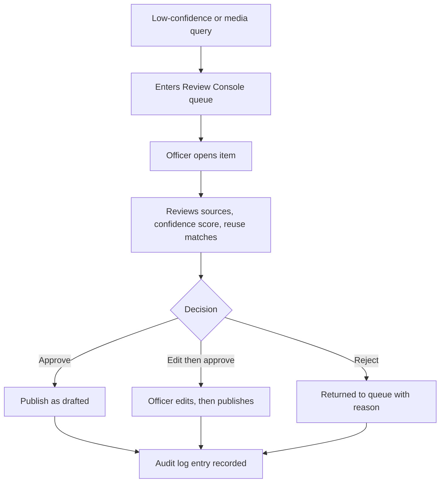
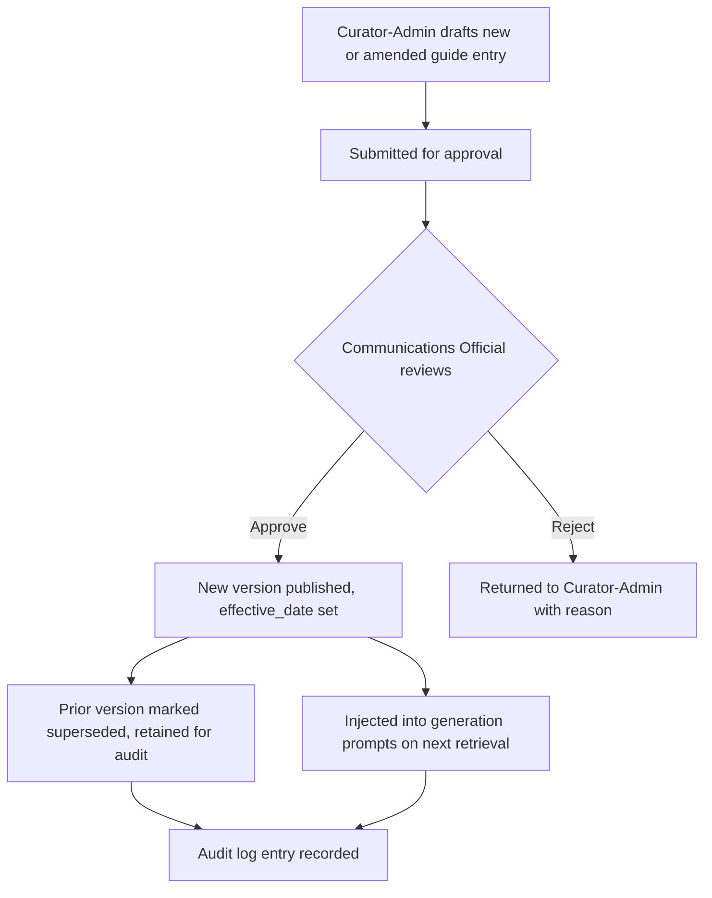

# Security, Governance and Compliance

This section defines the access-control model, data-protection controls and regulatory alignment for the Stats SA AI-Enabled Assistant. It also specifies the human-in-the-loop review workflow and the audit-logging model that keeps every AI-assisted response accountable.

## 1. Role-Based Access Control

Four roles govern the assistant. Each role's permissions map directly to the Mandatory Design Requirement for role-based access and to the functional split between self-service public answers and media-query escalation.

| Role | Can Do |
|---|---|
| Public User | Submit natural-language queries via the public website widget or chat interface; receive direct answers only when confidence is high and sources are approved; view inline citations; cannot access the Review Console or draft repository. |
| Media/Journalist | Submit media queries through an authenticated media-query form; view the status of their own submitted queries; cannot receive an automated direct answer; cannot approve, edit or publish any response. |
| Communications Official | Access the Review Console queue; view retrieved sources, confidence scores and reuse-repository matches for each item; approve, edit-then-approve or reject drafts; publish approved responses to requesters. |
| Curator-Admin | Upload, tag, version and retire source documents in the approved knowledge base; author, version, approve and retire entries in the Style and Terminology Guide (organisational communication guidelines, terminology and branding standards — Section 6); manage user roles and permissions; configure confidence thresholds and escalation rules; view full audit logs; cannot override a Communications Official's approval decision. |

Access is enforced server-side per request, not only in the interface, so a Public User account cannot reach Review Console endpoints even by direct API call. Role assignment for internal roles (Communications Official, Curator-Admin) requires provisioning by Stats SA IT against staff identity records, not self-registration.

The Curator-Admin role is the single role named "Knowledge Admin" in Table 1 of the Requirements Traceability document: it owns both source-document curation and Style and Terminology Guide versioning under one accountable identity, rather than splitting knowledge governance across two separate accounts. No other role can create or edit a guide entry, and a Communications Official's approval is still required before a new or amended entry takes effect (Section 6.3).

## 2. Data Protection Measures

### Encryption in Transit

All traffic between the public website, chat widget, API layer and backend services uses TLS 1.2 or higher, with TLS 1.3 preferred. HTTP Strict Transport Security is enforced on every public-facing endpoint to prevent protocol downgrade.

### Encryption at Rest

The document store, vector index and audit-log database are encrypted at rest using AES-256. Encryption keys are managed through a dedicated key-management service with role-separated custodianship, so no single administrator holds both data and key access.

### Data Minimisation for Query Submitters

The assistant does not collect ID numbers, phone numbers, physical addresses or precise location data from any user, public or media. Session identifiers are short-lived and rotate per session rather than persisting a stable user profile across visits.

Query text is retained only as long as needed to generate, review and audit a response, per the retention schedule in Section 5. Media-query submitters provide only a name, organisation and contact email needed to route the reviewed response back to them, consistent with collecting no more than the stated purpose requires.

## 3. South Africa Regulatory Alignment

### POPIA: The Eight Conditions for Lawful Processing

The Protection of Personal Information Act 4 of 2013 (POPIA) sets eight conditions for lawful processing in Chapter 3. The table below names each condition, its section basis, and the specific design feature that satisfies it.

| POPIA Condition | Sections | Design Feature |
|---|---|---|
| Accountability | s8 | A named Information Officer oversees the assistant; this document and its audit-log model form the accountability record. |
| Processing limitation | ss9-12 | Minimality: only session ID and query text are captured, no ID numbers or location data (Section 2 above); lawful basis is s11(1)(e), a function performed in the public interest under Stats SA's statutory mandate. |
| Purpose specification | ss13-14 | The assistant's in-product notice states the single purpose (answering statistical queries); chat-log retention follows the schedule in Section 5, not indefinite storage. |
| Further processing limitation | s15 | Query logs are used only for answer generation, review and audit; they are not repurposed for marketing, profiling or unrelated analytics. |
| Information quality | s16 | Curator-Admins version-control source documents and retire outdated publications, so retrieval draws only from current, accurate material. |
| Openness | ss17-18 | An in-product AI-use notice discloses that responses are AI-generated, states the purpose of data collection, and links to the Information Regulator complaint channel. |
| Security safeguards | ss19-22 | TLS in transit, AES-256 at rest, role-based access (Section 1), and a documented security-compromise notification procedure to the Information Regulator. |
| Data subject participation | ss23-25 | Users can request confirmation, access, correction or deletion of any personal data held, routed through the Stats SA Information Officer. |

Sources: [POPIA full text (SAFLII)](https://www.saflii.org/za/legis/consol_act/popia4o2013399/); [POPIA gazetted text (gov.za PDF)](https://www.gov.za/sites/default/files/gcis_document/201409/3706726-11act4of2013protectionofpersonalinforcorrect.pdf); [Section 10 Minimality](https://popia.co.za/section-10-minimality/); [Conditions of Lawful Processing (Schindlers Attorneys)](https://www.schindlers.co.za/the-conditions-of-lawful-processing-of-personal-information/).

### POPIA Section 71: Automated Decision-Making

POPIA s71 restricts decisions with legal or substantial effect based solely on automated profiling, but legal commentary confirms it contains no explicit right to an explanation and no duty to disclose automation. The assistant exceeds this baseline voluntarily: every response states it is AI-generated, and no query is ever resolved by automation alone when it is complex, sensitive, ambiguous or media-related (Functional Capability 3, Human-in-the-Loop Review).

This design choice closes the documented gap identified in POPIA scholarship rather than relying on it. Sources: [Section 71 Automated decision making](https://popia.co.za/section-71-automated-decision-making/); [Regulating Automated Decision-Making under POPIA (Pretoria Student Law Review)](https://upjournals.up.ac.za/index.php/pslr/article/view/5156); [Automated Decision-Making and the Right to an Explanation (Law, Technology and Humans)](https://lthj.qut.edu.au/article/view/4081); [Has POPIA prepared people to exercise this right? (De Rebus)](https://www.derebus.org.za/has-popia-adequately-prepared-people-to-exercise-their-right-not-to-be-subject-to-automated-decision-making/).

### National AI Policy Framework

The operative government AI guidance is the DCDT National Artificial Intelligence Policy Framework (2024), which names transparency and explainability as a core pillar. The assistant implements this pillar through per-claim source citation and a visible AI-generated-content disclaimer on every answer.

South Africa's fuller draft National AI Policy was approved for public comment in March 2026 and gazetted in April 2026, but withdrawn on 26 April 2026 after it was found to cite fabricated references. This document therefore treats the 2024 Framework, not the withdrawn April 2026 draft, as the current citable government position. Sources: [DCDT AI Policy Framework release (Bowmans)](https://bowmanslaw.com/insights/south-africa-department-of-communications-and-digital-technologies-releases-artificial-intelligence-policy-framework/); [DCDT official page](https://www.dcdt.gov.za/sa-national-ai-policy-framework.html); [Draft Policy 2026 withdrawal timeline (Wikipedia)](https://en.wikipedia.org/wiki/Draft_South_Africa_National_Artificial_Intelligence_(AI)_Policy_2026); [South Africa's AI policy cited fake research (The Conversation)](https://theconversation.com/south-africas-ai-policy-cited-fake-research-created-by-ai-what-lessons-need-to-be-learned-281671).

### Statistics Act, Batho Pele and PAIA

The Statistics Act 6 of 1999 imposes confidentiality duties stricter than POPIA: s8 bars unauthorised access to individual-level data and s17 guarantees confidentiality of individual records. The assistant only ever retrieves and cites aggregated, publicly published Stats SA outputs, never individual-level microdata, keeping it inside this stricter regime. Source: [Confidentiality and disclosure, Statistics South Africa](https://www.statssa.gov.za/?page_id=785).

Batho Pele's Openness and Transparency principle, and Constitution s195(1)(g)'s requirement of timely, accessible and accurate public information, are met by plain-language answers with verifiable references. Where the assistant surfaces links to published records, it aligns with PAIA's public-access mandate rather than replacing Stats SA's PAIA s14 manual process. Sources: [Batho Pele (Wikipedia)](https://en.wikipedia.org/wiki/Batho_Pele); [PAIA overview, Department of Justice](https://www.justice.gov.za/paia/paia.htm).

## 4. Human-in-the-Loop Workflow

Every low-confidence, complex, sensitive or media-related query routes to the Review Console before any response reaches a requester. The Communications Official sees the same evidence the model used, not just its output.

The reuse-repository matches shown at step D pull from the approved communication knowledge base (Functional Capability 6), so officials see prior similar responses before drafting a new one. A reject at step E returns the item with a required reason code, preventing silent drops of unanswered queries.

### Escalation Response-Time SLA

Every item entering the Review Console queue carries a priority tier, set automatically at intake, that fixes how quickly a Communications Official must act on it. This turns "human-in-the-loop" into a time-bound governance control rather than an open-ended queue.

| Escalation Tier | Trigger | Target First Review | Breach Escalation |
|---|---|---|---|
| Media query | Any query submitted through the authenticated Media/Journalist channel | Claimed and reviewed within 4 business hours of submission | If unclaimed after 4 hours, the queue auto-notifies the on-duty Communications Official supervisor and re-flags the item as overdue |
| Sensitive or ambiguous public query | Classifier flags the query as sensitive regardless of confidence score | Claimed and reviewed within 4 business hours, same target as a media query | Same supervisor auto-notification as above |
| Low-confidence public query | Confidence score falls below the auto-answer threshold but the query is not flagged sensitive | Claimed and reviewed within 8 business hours | If unclaimed after 8 hours, auto-escalated to the on-duty Communications Official and logged as an SLA breach |

"Business hours" follow Stats SA's standard operating hours (08:00-16:30 SAST, Monday to Friday, excluding public holidays). A query received outside these hours starts its SLA clock at the next business-hour open; a query flagged as deadline-sensitive by the submitting journalist instead pages the on-call Communications Official immediately, independent of business hours. Every SLA breach is written to the audit log (Section 5) so late reviews are visible for governance reporting rather than silently absorbed into queue backlog.

## 5. Accountability and Audit Logging

Every workflow transition writes an immutable audit-log entry: query text (session-scoped), retrieved source IDs, confidence score, reviewer identity, decision type, edit diff where applicable, SLA compliance status (on-time or breached, against the tier target in Section 4), and a timestamp. Reviewer identity is captured through Stats SA's staff authentication at the approval step, not self-declared.

Curator-Admin actions are logged separately: document upload, tagging, versioning and retirement, each tied to the admin's identity and timestamp. This gives a complete provenance trail from source document to published answer.

Retention follows POPIA's purpose-specification principle (ss13-14), which bars keeping personal information longer than the stated purpose needs. As a design default, raw query text is purged after 30 days while decision metadata (source IDs, confidence, decision type, reviewer, timestamp, SLA compliance status) is retained for 5 years to support audit, appeals and Information Regulator inquiries.

## 6. Organisational Knowledge and Communication Guidelines Governance

This section satisfies Mandatory Functional Capability 5 (Organisational Knowledge and Communication Guidelines) by defining the schema, versioning model, and approval/update workflow for the Style and Terminology Guide, and by specifying how that guidance is secured, maintained and updated over time.

### 6.1 Style and Terminology Guide Schema

The guide is a structured, versioned table injected into every generation prompt, not a static prose document. Each row is one piece of organisational guidance: a terminology choice, a style rule, a branding standard or a preferred phrasing.

| Field | Type | Description |
|---|---|---|
| guide_entry_id | UUID | Unique identifier for the guidance entry |
| category | enum | Terminology, Style Rule, Branding Standard, Preferred Phrasing, Prohibited Term |
| term_or_topic | string | The word, phrase or style area the entry governs |
| approved_guidance | string | The approved term, phrasing or style rule to use |
| discouraged_alternative | string, nullable | A term or phrasing the entry replaces or flags as incorrect |
| rationale | string | Why the guidance exists (e.g. statistical accuracy, POPIA-safe phrasing, house style, branding consistency) |
| version | integer | Sequential version number for this guide_entry_id |
| superseded_by | UUID, nullable | Entry that replaces this version |
| approved_by | string | Communications Official who approved the entry, alongside the authoring Curator-Admin |
| effective_date | date | Date the entry becomes binding on new generations |
| last_reviewed_date | date | Most recent review date, used to trigger periodic re-review |

### 6.2 Versioning Model

Entries are never edited in place. Every change creates a new version of the guide_entry_id, sets `superseded_by` on the prior version, and stamps a fresh `effective_date`. The orchestration layer injects only the current, non-superseded version of each entry into a generation prompt, mirroring how the Approved Sources Registry stops surfacing a superseded source (Section 4, 02-architecture.md). Superseded entries remain in the guide store, unretrievable for generation but intact for audit, so a reviewer can reconstruct which wording rule was active when a past response was drafted.

### 6.3 Update and Approval Workflow

A guide entry follows the same dual-control principle as a media response: the Curator-Admin (acting as Knowledge Admin) drafts it, and a Communications Official must approve it before it takes effect.

A rejection at step C returns the draft entry with a required reason code, the same discipline the Human-in-the-Loop Workflow (Section 4) applies to a rejected response draft.

### 6.4 Security and Ongoing Maintenance

- **Storage and access.** The guide store sits in the same document store as the Approved Sources Registry and inherits the same AES-256 encryption at rest and TLS-in-transit protections (Section 2). Only the Curator-Admin role can author or version an entry, and only a Communications Official can approve one; Public User and Media/Journalist accounts have no access, enforced server-side per Section 1.
- **Change accountability.** Every draft, approval, rejection and version supersession writes an audit-log entry tied to the acting official's authenticated identity and a timestamp, using the same immutable audit-log model as Section 5.
- **Review cadence.** Every entry carries a scheduled review at least once every 6 months via `last_reviewed_date`, in addition to ad hoc updates triggered by a new official release naming convention, an updated Stats SA branding standard, or a reviewer-flagged terminology gap during Human-in-the-Loop review (Section 4).
- **Retention.** Because guide entries are organisational guidance rather than personal information, the POPIA purge schedule in Section 5 does not apply to them: the full version history is retained indefinitely, giving a permanent record of why a given response used specific terminology or phrasing.

## Judging Criterion Alignment

The following sentences in this document directly address "Security, Governance and Responsible Technology Use": the Role-Based Access Control table (Section 1), the encryption and data-minimisation measures (Section 2), the POPIA eight-conditions mapping and POPIA s71 discussion (Section 3), the Human-in-the-Loop Workflow diagram and escalation response-time SLA (Section 4), the audit-logging fields and retention rationale (Section 5), and the Style and Terminology Guide's schema, versioning model and approval workflow (Section 6). Together they demonstrate cybersecurity controls, POPIA-grounded privacy safeguards, responsible-AI transparency per the DCDT National AI Policy Framework, a time-bound human-oversight guarantee, and secure, accountable governance of organisational communication guidance over time.
