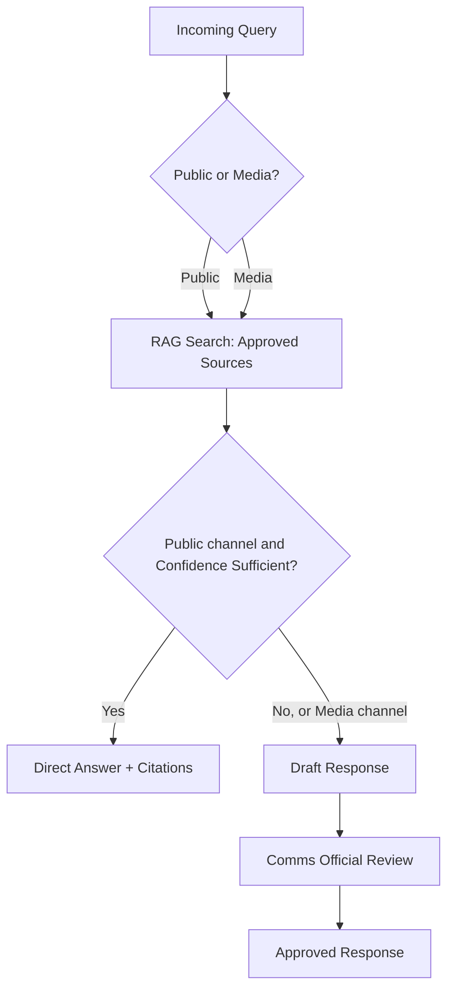

# Judging Criteria Alignment

This section maps the AI-Enabled Assistant design to all 8 GovTech 2026 adjudication criteria. Scoring is deliberately candid rather than promotional. Weak spots are named alongside strengths so the team can prepare honest answers for judges.

## Query Routing Flow Referenced Across Criteria

Several criteria below reference the same two-track routing logic: public queries answer directly when confidence is high, media queries always require review.

Both channels retrieve from the Approved Sources Registry/Index before branching; only a public query that clears the confidence gate short-circuits to a direct answer, matching the architecture and sequence diagrams in 02-architecture.md.

## Scoring Table

| # | Criterion | Weight | How this solution scores against it | Evidence |
|---|-----------|--------|--------------------------------------|----------|
| 1 | Relevance to the Challenge Statement | 20% | Maps directly onto both mandatory functional capabilities: public self-service search and media query escalation. Covers all 5 mandatory design requirements through the two-track routing flow above. This is the strongest scoring category because the design vocabulary mirrors the challenge statement's own terms. | See 02-architecture.md, 01-requirements-traceability.md |
| 2 | Innovation and Use of Emerging Technologies | 15% | Combines retrieval-augmented generation over an approved-source corpus with confidence-based routing and prior-response reuse recommendation. These are established open-source patterns, not novel research, so this is a moderate rather than standout score. Differentiation depends on demoing confidence scoring and reuse matching convincingly. | See 02-architecture.md, 05-mvp-scope-and-roadmap.md |
| 3 | Technical Feasibility and Functionality | 20% | Hardest criterion to score well given a short build window covering ingestion, retrieval, escalation, and a review queue. MVP scope trims to a working retrieval pipeline and a minimal review interface, leaving some mandatory capabilities partially built at demo time. Judges should expect a narrower but functioning slice rather than the full design. | See 05-mvp-scope-and-roadmap.md |
| 4 | User Experience, Accessibility and Inclusivity | 10% | No dedicated design phase occurred before the build; the interface is a minimal chat widget plus a plain review dashboard. Plain-language answers and visible citations help readability, but WCAG conformance is not verified. Two further dimensions this criterion names are also unaddressed by the MVP: low-bandwidth/resource-constrained environments (no lite or low-data mode, no offline or low-connectivity fallback, and no lighter-weight channel such as SMS/USSD) and varying digital literacy (no guided or simplified query mode and no in-context help for first-time users). These are honest gaps, not oversights to hide from judges. | See 05-mvp-scope-and-roadmap.md |
| 5 | Data, Intelligence and Insight Generation | 10% | Every answer cites its source document and title, giving explainability by default. Confidence scoring and gap-flagging on media queries expose the limits of the data to reviewers rather than hiding them. Trend analytics on recurring queries is an optional-tier feature, not part of MVP. | See 02-architecture.md, 05-mvp-scope-and-roadmap.md |
| 6 | Security, Governance and Responsible Technology Use | 10% | Role-based access separates public users, media users, and communication officials at the interface layer, enforced server-side on every request. Human approval gates all media and low-confidence responses, and answers are labeled as AI-drafted or officially approved. Audit logging (query submission, retrieval, generation, escalation, edit and approval, each timestamped and tied to an actor) is built and demoed for the hackathon, not deferred; a formal POPIA compliance sign-off and third-party penetration testing remain roadmap items beyond the hackathon build. | See 02-architecture.md, 03-security-governance-compliance.md, 05-mvp-scope-and-roadmap.md |
| 7 | Scalability, Sustainability and Digital Sovereignty | 10% | Built on open-source components for the vector store, embedding model, and orchestration layer to avoid vendor lock-in. An API-first design supports later integration with the existing Stats SA website. Long-term sustainability depends on Stats SA staff maintaining the approved-source corpus, which the roadmap flags as an open question. | See 02-architecture.md, 05-mvp-scope-and-roadmap.md |
| 8 | Presentation, Demonstration and Communication | 5% | The demo script walks both routing paths: an instant cited public answer, then a media query producing a draft awaiting approval. Time pressure risks compressing the human-in-the-loop story into a few seconds of screen time. The script is written to keep that moment explicit rather than rushed. | See 05-mvp-scope-and-roadmap.md |

## Biggest Risk Areas

- **Technical Feasibility (20%)**: build time is the binding constraint. Mitigation is the MVP cut in 05-mvp-scope-and-roadmap.md, which drops guideline-style enforcement and analytics dashboards to a later-phase slide.
- **User Experience (10%)**: no design pass happened before coding started. Mitigation is limiting the demo to one chat interface and one review queue, per the single-interface decision in 05-mvp-scope-and-roadmap.md, instead of spreading effort across multiple screens.
- **Security and Governance (10%)**: judges expect concrete controls, not intentions. Mitigation is building role-based access and the human-approval gate first, since 05-mvp-scope-and-roadmap.md sequences these before optional features.
- **Innovation (15%)**: the underlying techniques are common RAG patterns. Mitigation is foregrounding the two features that are less common in similar entries, confidence-based routing and reuse recommendation, both scoped into MVP in 05-mvp-scope-and-roadmap.md.
