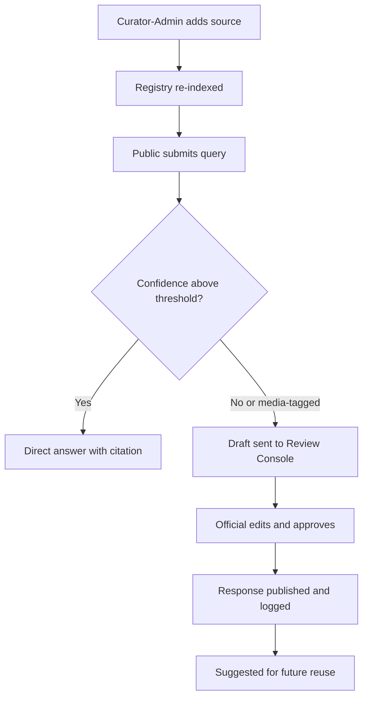

# Hackathon MVP Scope, Demo Plan and Roadmap

This document defines what the team builds and demonstrates for the GovTech 2026 hackathon. It scopes the AI-Enabled Assistant for Public and Media Information Queries against the Stats SA challenge statement. It separates what runs live on demo day from what is deferred to a post-hackathon build.

It also sets out the risks and next steps judges will raise. These map directly to Technical Feasibility and Functionality, Scalability, Sustainability and Digital Sovereignty, and Presentation, Demonstration and Communication.

## 1. MVP Scope

The table below fixes scope per area before the build sprint starts. Any new feature request is routed to the Roadmap section, not added mid-sprint.

| Area | In scope for demo | Deferred |
|---|---|---|
| Registry content | 15-30 curated Stats SA releases ingested with metadata: title, source URL, publication date, category, approver. Examples include QLFS, CPI, mid-year population estimates and the GDP release. A vector index covers these documents plus a short communication-guideline and terminology file. | Full publication catalogue ingestion, covering hundreds of releases across all Stats SA series. Scheduled automated re-crawl of the Stats SA website. A formal versioning workflow for superseded releases. |
| Public query path | Chat widget accepts a natural-language query. It retrieves top-k passages from the registry and returns a plain-language answer with a confidence score. Citations (title, link, publication date) are attached whenever confidence clears a fixed threshold, e.g. 0.75. | Voice input and full WCAG 2.1 AA certification. Production-grade rate limiting and bot protection. Persistent multi-turn memory across separate sessions. |
| Media query path | A separate intake form tags a query as "media." Media queries always escalate regardless of confidence. The system generates a structured draft (headline, key figures, citations, suggested tone) and routes it to the Review Console; no automatic reply is sent. | Direct integration with a newsroom CRM. Automated distribution to journalist mailing lists. Embargo-date handling on unreleased statistics. |
| Curator-admin | A web UI to add or remove a source document, by PDF upload or URL. The curator tags its category and triggers re-embedding. The same UI edits a short list of approved terminology and style notes. | A full document lifecycle workflow: draft, review, retire. Per-document granular access control. Automated broken-link scanning across the entire Stats SA site. |
| Communication memory | A repository of approved responses: query text, final answer, citations, approving official, approval date. The repository is searchable by keyword. On a new query, the system surfaces the closest matching approved response as a suggested reuse. | Semantic clustering of duplicate topics at scale. A reuse-rate analytics dashboard. Automatic topic tagging via a trained classifier. |
| Security | Role-based access control across four roles: Public, Media Requester, Communications Official, Curator-Admin. All four are enforced at the API layer. An audit log records query submission, retrieval, generation, escalation, edit and approval events. Secrets are held in environment variables and the demo runs over HTTPS. | Single sign-on with the Stats SA identity provider. Formal POPIA compliance sign-off. Third-party penetration testing and HSM-managed encryption keys. |
| Integration | A REST API plus an embeddable JavaScript widget snippet. Both are demonstrated inside a static mock of the Stats SA page header and layout. | Native integration with the live statssa.gov.za CMS. Single sign-on with existing site analytics. Production CDN deployment and cache invalidation. |

## 2. Demo Script

The script below is timed to fit a 5-8 minute judging slot and is written to satisfy Presentation, Demonstration and Communication. Each step maps to one mandatory functional capability.

1. **Public query, direct answer.** Open the widget embedded in the mock Stats SA page and submit: "What was the latest quarterly unemployment rate?" Show the plain-language answer with its confidence score and a citation linking to the source QLFS release.
2. **Escalation on a sensitive query.** Submit a media-style query: "Why did the unemployment rate change and what does it mean for the economy?" Show the system tag it as media/low-confidence and route it to the Review Console instead of auto-answering.
3. **Official review and approval.** Switch to the Communications Official view. Open the queued draft in the Review Console, show its citations and confidence score, edit one sentence, then click Approve.
4. **Communication memory reuse.** Submit a second, related media query. Show the system surface the just-approved response as a suggested reuse match, with its similarity score.
5. **Curator-admin live source addition.** Switch to the Curator-Admin view, upload a new Stats SA PDF release, tag its category, and trigger re-indexing. Then ask a question only that document can answer, and show the citation pointing to it.
6. **Audit trail.** Open the Audit Log. Show the full trail for the demoed queries: submission, retrieval, generation, escalation, edit and approval. Each entry carries a timestamp and actor identity.

## 3. Risk Register

| Risk | Likelihood | Impact | Mitigation |
|---|---|---|---|
| Hallucination or unsupported claims in a generated answer | Medium | High | Answer generation is restricted to retrieved passages only. The system withholds a direct answer when top-passage similarity falls below threshold, and every displayed claim carries a citation. |
| PDF/table parsing errors on statistical tables and footnotes | High | Medium | Use a layout-aware parser for ingestion. Curator-admin reviews any flagged table before it enters the index. |
| Scope creep beyond the MVP scope table | Medium | Medium | Scope is frozen before the build sprint starts. New feature ideas are logged to the Roadmap section and need product-owner sign-off to pull forward. |
| Demo-day connectivity failure (venue Wi-Fi or API outage) | Medium | High | Keep a pre-recorded fallback video of the full script. Run the demo against a local build with a cached registry snapshot. Test the venue network the day before. |
| Data staleness (registry lags the latest Stats SA release) | Medium | Medium | Show a "last indexed" timestamp on every answer. Re-ingest the curated document set the morning of the demo. Keep the re-index button visible in Curator-Admin. |
| Judge time limits (typically 5-10 minute slots) | High | Medium | Script the six demo steps to under 6 minutes. Pre-stage browser tabs and role logins. Rehearse twice against a timer before the session. |
| RBAC misconfiguration exposing an unapproved draft | Low | High | Enforce role checks server-side on every API call. Use four pre-provisioned demo accounts, one per role. Deny access by default. |

## 4. Roadmap and Future Considerations

| Phase | Timeframe | Focus |
|---|---|---|
| Hackathon MVP | Demo day | Six scope areas above, on a curated 15-30 document registry. |
| Pilot | 0-3 months | Curator-admin handover, expanded registry, internal Stats SA testing. |
| Rollout | 3-9 months | Live website integration, multilingual support, monitoring in production. |

**Governance handover of curator-admin.** The curator-admin role moves from the hackathon team to Stats SA Corporate Communications within 90 days. Handover includes a written standard operating procedure, a training session, and a named accountable owner for source approval.

**Full publication catalogue ingestion.** The registry expands from the demo's 15-30 documents to the full Stats SA publication catalogue. Ingestion is phased by release category (economic, social, census) with a scheduled crawler replacing manual upload.

**Live integration with the Stats SA website.** The widget and API move from the mock page to statssa.gov.za through the department's own content management system. Rollout follows a staging environment, then a limited public beta, then general availability, coordinated with the Stats SA IT security review.

**Multilingual expansion.** Response generation adds South Africa's other official languages, starting with isiZulu and Afrikaans. Every translated response passes human review by a Communications Official before it is treated as approved.

**Monitoring and feedback loop.** Query volume, confidence scores, escalation rates and reviewer edit patterns are logged and reviewed monthly. Recurring low-confidence topics feed directly into the registry ingestion backlog as new source candidates.
