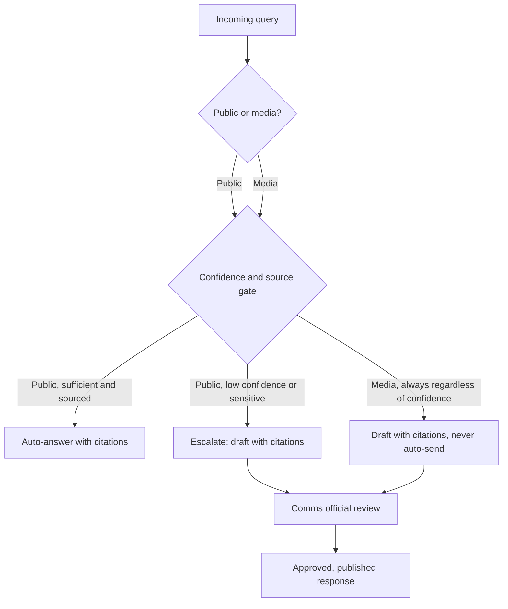

# Precedent Analysis and Differentiation

## Scope of This Comparison

This section compares the proposed Stats SA AI-Enabled Assistant against confirmed public-sector precedents.
It covers South African agencies and international national statistics offices with documented AI query tools.

No evidence exists of Stats SA itself operating a public chatbot; statssa.gov.za and public tender listings show none as of the research date.
That absence makes this solution a first-of-its-kind capability for the department domestically.

## Precedent Landscape

Ten precedents were reviewed against the two mandatory functional capabilities: public self-service search and media-query escalation.
Each row states what the precedent does, its documented gap, and how this solution's design closes that gap.

| Precedent | What it does | Known limitation / gap | How this solution differs or improves |
|---|---|---|---|
| [SARS AI Assistant](https://www.sars.gov.za/latest-news/sars-ai-assistant-allows-taxpayers-to-interact-online-with-sars-24-7/) (Dec 2024) | Conversational assistant answering taxpayer, trader and traveller questions from published SARS information only | No publicly documented per-answer citation, confidence score, or media-query escalation track | Adds Functional Capability 1's mandatory reference links and confidence-gated escalation, not just topic scoping |
| [SARS ChatBot Lwazi](https://www.sars.gov.za/latest-news/chatbot-lwazi-enhancements/) | Older structured chatbot in eFiling and MobiApp for predefined tax queries and callbacks | Limited to menu-driven, structured queries rather than open natural language | Uses retrieval over approved documents so free-text statistical questions are answered, not just menu paths |
| [SARS WhatsApp self-service](https://www.sars.gov.za/latest-news/sars-launched-a-self-service-whatsapp-channel/) | Retrieves tax reference numbers, statements, refund and audit status via registered mobile number | Restricted to predefined transactional lookups, no open-ended statistical Q&A | Targets open natural-language public and media queries, not fixed transaction types |
| [DPSA government chatbot pilot](https://www.sanews.gov.za/south-africa/ai-chatbot-brings-batho-principles-future) | Gives public servants policy, circular and legislation answers in nine official languages | Serves internal public servants, not the public or media; no stated citation or confidence mechanism | Serves external public and media users directly per the challenge statement, with mandatory source citations |
| [Statistics Canada IntelliStatCan](https://www.statcan.gc.ca/en/help/intelligent-search) | RAG tool citing the source PDF publication for each retrieved answer | Scoped to PDF publications only, not tables, charts or data; carries a blanket "may be incorrect" disclaimer; warns users not to enter personal data | Extends grounding to structured data sources and adds per-claim confidence signals, not only a blanket disclaimer |
| [StatCan 2026 Census Chatbot](https://www.statcan.gc.ca/en/trust/collecting-your-data/artificial-intelligence) | Answers FAQs from a human-curated, subject-matter-expert-reviewed answer bank, escalates to live agents | Coverage limited to pre-written FAQ content; no described structured draft-with-citation workflow for media | Combines a curated communication knowledge repository (Functional Capability 6) with generative drafting for novel queries |
| [UK ONS generative AI use](https://www.ons.gov.uk/aboutus/transparencyandgovernance/freedomofinformationfoi/onsuseofgenerativeaichatbots) | Approves only internal Microsoft Copilot tools for staff productivity, no public statistical chatbot | No public-facing self-service capability exists at all; generative AI stays internal-only | Delivers the public self-service assistant the challenge statement requires, governed rather than withheld |
| [GOV.UK Chat](https://www.thinkdigitalpartners.com/news/2026/05/18/gov-uk-gets-conversational-as-government-launches-ai-chatbot/) | Cross-government assistant answering questions on childcare, tax and driving services | Independent testing found incorrect childcare-eligibility and capital-gains-tax guidance despite AI Security Institute review | Applies retrieval-quality gating and claim-level grounding checks before any unsourced claim reaches a user |
| [Eurostat planned RAG chatbot (AIML4OS)](https://www.winssolutions.org/eurostat-ai-in-official-statistics/) | In development; will ground answers in Eurostat datasets, metadata and glossaries with live data retrieval | Not yet live; Eurostat's own risk framework flags unresolved explainability and reproducibility of AI outputs | Publishes a model-card-style explainability record and human-verification step before any output is used, addressing the same flagged risk |
| [US Census Bureau data API MCP server](https://github.com/uscensusbureau/us-census-bureau-data-api-mcp) | Open-source MCP server exposing Census Data API endpoints to third-party AI assistants | Requires a technical client and Census API key; no conversational interface for non-technical public users | Pairs an equivalent open API/MCP layer with a plain-language chat interface for non-technical citizens and journalists |

## Recurring Pattern Across Precedents

Six practices recur across these precedents and map directly onto the mandatory design requirements.

- Scoping answers strictly to published, approved sources: SARS AI Assistant, IntelliStatCan, and the planned Eurostat system.
- Per-answer source citation: IntelliStatCan, Vertex AI grounding, and AWS Bedrock Knowledge Bases citation attachment.
- Human-curated answer banks for high-stakes content: the StatCan Census Chatbot, rather than pure free generation.
- Explicit statements that the tool does not replace human judgement: the DPSA pilot and GOV.UK Chat's non-personalised-advice framing.
- Routing unresolved queries to a human channel: the StatCan Census Chatbot's live-agent escalation and SARS callback requests.
- Governance oversight before wider rollout: the ONS AI Leadership Group and Eurostat's AIML4OS risk framework.

None of the reviewed precedents combine all six practices with a mandatory, non-optional media-query escalation track.

## Differentiated Query-Routing Flow

The reviewed public-sector tools mostly use a single answer path: retrieve, generate, respond.
This solution instead routes public and media queries onto separate tracks before any response is generated, per Functional Capabilities 1 and 2.

Both tracks pass through the same retrieval and source gate before branching, consistent with the single Retrieval and Orchestration Layer both the Public Widget and Media Intake Channel feed into in the system architecture; the difference is that media queries always route to the review draft regardless of the gate's confidence outcome, while public queries only escalate when confidence is low or the query is sensitive.
None of SARS AI Assistant, IntelliStatCan or GOV.UK Chat implement this mandatory media-side non-auto-response branch.
Eurostat's risk framework calls for mandatory human verification before publication, which this flow implements structurally rather than as guidance alone.

## Gap Stats SA's Solution Closes

Three gaps separate the reviewed precedents from the challenge's requirements.

- No precedent pairs per-claim citation enforcement, as in Anthropic's Citations API or Vertex AI grounding, with a human-curated repository like StatCan's Census Chatbot.
- No reviewed system makes media-query escalation mandatory rather than optional, as Functional Capability 2 requires.
- None publish an explicit UI distinction between grounded source text and AI-synthesized wording, unlike Claude's uncertainty-caveat pattern and Granola's transcript-versus-summary separation.

## Innovation and Local Digital Capability

Stats SA currently has no public chatbot, so this solution is a domestically original application rather than a copy of an existing local tool.
It advances the "Innovation and Use of Emerging Technologies" criterion by combining confidence-gated retrieval, structural citation enforcement and mandatory media escalation in one architecture.
No reviewed precedent combines all three mechanisms in a single system.

Building this locally, on open-source retrieval and evaluation components such as hybrid search and RAGAS, builds indigenous technical capability inside Stats SA.
This reduces dependence on a vendor's closed pipeline.
This directly supports the criterion's emphasis on local innovation and indigenous digital capability, alongside South Africa's broader digital-sovereignty goals.
